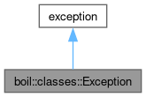

<!DOCTYPE html PUBLIC "-//W3C//DTD XHTML 1.0 Transitional//EN" "https://www.w3.org/TR/xhtml1/DTD/xhtml1-transitional.dtd">
<html xmlns="http://www.w3.org/1999/xhtml" lang="en-US">
<head>
<meta http-equiv="Content-Type" content="text/xhtml;charset=UTF-8"/>
<meta http-equiv="X-UA-Compatible" content="IE=11"/>
<meta name="generator" content="Doxygen 1.9.8"/>
<meta name="viewport" content="width=device-width, initial-scale=1"/>
<title>RMST: boil::classes::Exception Class Reference</title>
<link href="tabs.css" rel="stylesheet" type="text/css"/>

<link href="navtree.css" rel="stylesheet" type="text/css"/>

<link href="search/search.css" rel="stylesheet" type="text/css"/>

<link href="doxygen.css" rel="stylesheet" type="text/css" />
<link href="doxygen-awesome.css" rel="stylesheet" type="text/css"/>
<link href="doxygen-awesome-sidebar-only.css" rel="stylesheet" type="text/css"/>
<link href="doxygen-awesome-sidebar-only-darkmode-toggle.css" rel="stylesheet" type="text/css"/>
</head>
<body>

<!-- do not remove this div, it is closed by doxygen! -->

<table cellspacing="0" cellpadding="0">
 <tbody>
 <tr id="projectrow">
  <td id="projectalign">
   
RMST
   

  </td>
 </tr>
 </tbody>
</table>

<!-- end header part -->
<!-- Generated by Doxygen 1.9.8 -->

<!-- top -->

  

    

      

    

  

  

  

<!-- window showing the filter options -->

<!-- iframe showing the search results (closed by default) -->

Loading...

Searching...

No Matches

  

<a href="#pub-methods">Public Member Functions</a> &#124;
<a href="#pri-attribs">Private Attributes</a> &#124;
<a href="classboil_1_1classes_1_1Exception-members.md">List of all members</a>  

  

boil::classes::Exception Class Referenceexport
module <a class="el" href="module_boilerplate.md">boilerplate</a>

<!--header-->

Inheritance diagram for boil::classes::Exception:

<map name="aboil_1_1classes_1_1Exception_inherit__map" id="aboil_1_1classes_1_1Exception_inherit__map">
<area shape="rect" title=" " alt="" coords="5,79,160,105"/>
<area shape="rect" title=" " alt="" coords="44,5,121,31"/>
<area shape="poly" title=" " alt="" coords="85,46,85,79,80,79,80,46"/>
</map>

[<a target="top" href="graph_legend.md">legend</a>]

Collaboration diagram for boil::classes::Exception:

<map name="aboil_1_1classes_1_1Exception_coll__map" id="aboil_1_1classes_1_1Exception_coll__map">
<area shape="rect" title=" " alt="" coords="5,79,160,105"/>
<area shape="rect" title=" " alt="" coords="44,5,121,31"/>
<area shape="poly" title=" " alt="" coords="85,46,85,79,80,79,80,46"/>
</map>

[<a target="top" href="graph_legend.md">legend</a>]

<table class="memberdecls">
<tr class="heading"><td colspan="2"><h2 class="groupheader">
Public Member Functions</h2></td></tr>
<tr class="memitem:a64cb1dbb7265ca2e97d4a9dc3acc8f12" id="r_a64cb1dbb7265ca2e97d4a9dc3acc8f12"><td class="memItemLeft" align="right" valign="top">&#160;</td><td class="memItemRight" valign="bottom"><a class="el" href="classboil_1_1classes_1_1Exception.md#a64cb1dbb7265ca2e97d4a9dc3acc8f12">Exception</a> (<a class="el" href="namespaceboil_1_1utilities.md#af4fbd541ada4a7eecf3b675d77457d2c">string_view</a> <a class="el" href="namespaceboil_1_1utilities.md#af4fbd541ada4a7eecf3b675d77457d2c">info</a>=&quot;Unknown exception.&quot;, <a class="el" href="namespaceboil_1_1utilities.md#af4fbd541ada4a7eecf3b675d77457d2c">source_location</a> <a class="el" href="namespaceboil_1_1utilities.md#af4fbd541ada4a7eecf3b675d77457d2c">location</a>=source_location::current(), <a class="el" href="namespaceboil_1_1utilities.md#af4fbd541ada4a7eecf3b675d77457d2c">stacktrace</a> <a class="el" href="namespaceboil_1_1utilities.md#af4fbd541ada4a7eecf3b675d77457d2c">moment</a>=stacktrace::current(1))</td></tr>
<tr class="separator:a64cb1dbb7265ca2e97d4a9dc3acc8f12"><td class="memSeparator" colspan="2">&#160;</td></tr>
<tr class="memitem:a275be9f331ce3acfb85bd6d7bf48da78" id="r_a275be9f331ce3acfb85bd6d7bf48da78"><td class="memItemLeft" align="right" valign="top"><a class="el" href="namespaceboil_1_1utilities.md#af4fbd541ada4a7eecf3b675d77457d2c">const</a> <a class="el" href="namespaceboil_1_1utilities.md#af4fbd541ada4a7eecf3b675d77457d2c">char</a> *&#160;</td><td class="memItemRight" valign="bottom"><a class="el" href="classboil_1_1classes_1_1Exception.md#a275be9f331ce3acfb85bd6d7bf48da78">what</a> () <a class="el" href="namespaceboil_1_1utilities.md#af4fbd541ada4a7eecf3b675d77457d2c">const</a> <a class="el" href="namespaceboil_1_1utilities.md#af4fbd541ada4a7eecf3b675d77457d2c">noexcept</a> <a class="el" href="namespaceboil_1_1utilities.md#af4fbd541ada4a7eecf3b675d77457d2c">override</a></td></tr>
<tr class="separator:a275be9f331ce3acfb85bd6d7bf48da78"><td class="memSeparator" colspan="2">&#160;</td></tr>
<tr class="memitem:a0d51ef0e7016aaedba6e1ce034aff686" id="r_a0d51ef0e7016aaedba6e1ce034aff686"><td class="memItemLeft" align="right" valign="top"><a class="el" href="namespaceboil_1_1utilities.md#af4fbd541ada4a7eecf3b675d77457d2c">virtual</a> <a class="el" href="namespaceboil_1_1utilities.md#af4fbd541ada4a7eecf3b675d77457d2c">const</a> <a class="el" href="namespaceboil_1_1utilities.md#af4fbd541ada4a7eecf3b675d77457d2c">source_location</a> &amp;&#160;</td><td class="memItemRight" valign="bottom"><a class="el" href="classboil_1_1classes_1_1Exception.md#a0d51ef0e7016aaedba6e1ce034aff686">where</a> () <a class="el" href="namespaceboil_1_1utilities.md#af4fbd541ada4a7eecf3b675d77457d2c">const</a> <a class="el" href="namespaceboil_1_1utilities.md#af4fbd541ada4a7eecf3b675d77457d2c">noexcept</a></td></tr>
<tr class="separator:a0d51ef0e7016aaedba6e1ce034aff686"><td class="memSeparator" colspan="2">&#160;</td></tr>
<tr class="memitem:a1fd67224f0764f45b11cff42ab2115b0" id="r_a1fd67224f0764f45b11cff42ab2115b0"><td class="memItemLeft" align="right" valign="top"><a class="el" href="namespaceboil_1_1utilities.md#af4fbd541ada4a7eecf3b675d77457d2c">virtual</a> <a class="el" href="namespaceboil_1_1utilities.md#af4fbd541ada4a7eecf3b675d77457d2c">const</a> <a class="el" href="namespaceboil_1_1utilities.md#af4fbd541ada4a7eecf3b675d77457d2c">stacktrace</a> &amp;&#160;</td><td class="memItemRight" valign="bottom"><a class="el" href="classboil_1_1classes_1_1Exception.md#a1fd67224f0764f45b11cff42ab2115b0">when</a> () <a class="el" href="namespaceboil_1_1utilities.md#af4fbd541ada4a7eecf3b675d77457d2c">const</a> <a class="el" href="namespaceboil_1_1utilities.md#af4fbd541ada4a7eecf3b675d77457d2c">noexcept</a></td></tr>
<tr class="separator:a1fd67224f0764f45b11cff42ab2115b0"><td class="memSeparator" colspan="2">&#160;</td></tr>
</table><table class="memberdecls">
<tr class="heading"><td colspan="2"><h2 class="groupheader">
Private Attributes</h2></td></tr>
<tr class="memitem:a2b90febf541388d1fc53861f4eb1d3f0" id="r_a2b90febf541388d1fc53861f4eb1d3f0"><td class="memItemLeft" align="right" valign="top"><a class="el" href="namespaceboil_1_1utilities.md#af4fbd541ada4a7eecf3b675d77457d2c">string</a>&#160;</td><td class="memItemRight" valign="bottom"><a class="el" href="classboil_1_1classes_1_1Exception.md#a2b90febf541388d1fc53861f4eb1d3f0">_info</a></td></tr>
<tr class="separator:a2b90febf541388d1fc53861f4eb1d3f0"><td class="memSeparator" colspan="2">&#160;</td></tr>
<tr class="memitem:ac9b438099fb3dc70316dcc22d7ce80ea" id="r_ac9b438099fb3dc70316dcc22d7ce80ea"><td class="memItemLeft" align="right" valign="top"><a class="el" href="namespaceboil_1_1utilities.md#af4fbd541ada4a7eecf3b675d77457d2c">source_location</a>&#160;</td><td class="memItemRight" valign="bottom"><a class="el" href="classboil_1_1classes_1_1Exception.md#ac9b438099fb3dc70316dcc22d7ce80ea">_location</a></td></tr>
<tr class="separator:ac9b438099fb3dc70316dcc22d7ce80ea"><td class="memSeparator" colspan="2">&#160;</td></tr>
<tr class="memitem:ac71a8d995ff4b13064971815584ee6b9" id="r_ac71a8d995ff4b13064971815584ee6b9"><td class="memItemLeft" align="right" valign="top"><a class="el" href="namespaceboil_1_1utilities.md#af4fbd541ada4a7eecf3b675d77457d2c">stacktrace</a>&#160;</td><td class="memItemRight" valign="bottom"><a class="el" href="classboil_1_1classes_1_1Exception.md#ac71a8d995ff4b13064971815584ee6b9">_moment</a></td></tr>
<tr class="separator:ac71a8d995ff4b13064971815584ee6b9"><td class="memSeparator" colspan="2">&#160;</td></tr>
</table>
<h2 class="groupheader">Detailed Description</h2>

Definition at line <a class="el" href="boilerplate_8cpp_source.md#l00043">43</a> of file <a class="el" href="boilerplate_8cpp_source.md">boilerplate.cpp</a>.

<h2 class="groupheader">Constructor &amp; Destructor Documentation</h2>

<h2 class="memtitle"><a href="#a64cb1dbb7265ca2e97d4a9dc3acc8f12">&#9670;&#160;</a>Exception()</h2>

<table class="mlabels">
  <tr>
  <td class="mlabels-left">
      <table class="memname">
        <tr>
          <td class="memname">boil::classes::Exception::Exception </td>
          <td>(</td>
          <td class="paramtype"><a class="el" href="namespaceboil_1_1utilities.md#af4fbd541ada4a7eecf3b675d77457d2c">string_view</a>&#160;</td>
          <td class="paramname"><em>info</em> = <code>&quot;Unknown&#160;exception.&quot;</code>, </td>
        </tr>
        <tr>
          <td class="paramkey"></td>
          <td></td>
          <td class="paramtype"><a class="el" href="namespaceboil_1_1utilities.md#af4fbd541ada4a7eecf3b675d77457d2c">source_location</a>&#160;</td>
          <td class="paramname"><em>location</em> = <code>source_location::current()</code>, </td>
        </tr>
        <tr>
          <td class="paramkey"></td>
          <td></td>
          <td class="paramtype"><a class="el" href="namespaceboil_1_1utilities.md#af4fbd541ada4a7eecf3b675d77457d2c">stacktrace</a>&#160;</td>
          <td class="paramname"><em>moment</em> = <code>stacktrace::current(1)</code>&#160;</td>
        </tr>
        <tr>
          <td></td>
          <td>)</td>
          <td></td><td></td>
        </tr>
      </table>
  </td>
  <td class="mlabels-right">
inlineexport  </td>
  </tr>
</table>

Definition at line <a class="el" href="boilerplate_8cpp_source.md#l00045">45</a> of file <a class="el" href="boilerplate_8cpp_source.md">boilerplate.cpp</a>.

<h2 class="groupheader">Member Function Documentation</h2>

<h2 class="memtitle"><a href="#a275be9f331ce3acfb85bd6d7bf48da78">&#9670;&#160;</a>what()</h2>

<table class="mlabels">
  <tr>
  <td class="mlabels-left">
      <table class="memname">
        <tr>
          <td class="memname"><a class="el" href="namespaceboil_1_1utilities.md#af4fbd541ada4a7eecf3b675d77457d2c">const</a> <a class="el" href="namespaceboil_1_1utilities.md#af4fbd541ada4a7eecf3b675d77457d2c">char</a> * boil::classes::Exception::what </td>
          <td>(</td>
          <td class="paramname"></td><td>)</td>
          <td> const</td>
        </tr>
      </table>
  </td>
  <td class="mlabels-right">
inlineoverrideexportnoexcept  </td>
  </tr>
</table>

Definition at line <a class="el" href="boilerplate_8cpp_source.md#l00050">50</a> of file <a class="el" href="boilerplate_8cpp_source.md">boilerplate.cpp</a>.

<h2 class="memtitle"><a href="#a1fd67224f0764f45b11cff42ab2115b0">&#9670;&#160;</a>when()</h2>

<table class="mlabels">
  <tr>
  <td class="mlabels-left">
      <table class="memname">
        <tr>
          <td class="memname"><a class="el" href="namespaceboil_1_1utilities.md#af4fbd541ada4a7eecf3b675d77457d2c">virtual</a> <a class="el" href="namespaceboil_1_1utilities.md#af4fbd541ada4a7eecf3b675d77457d2c">const</a> <a class="el" href="namespaceboil_1_1utilities.md#af4fbd541ada4a7eecf3b675d77457d2c">stacktrace</a> &amp; boil::classes::Exception::when </td>
          <td>(</td>
          <td class="paramname"></td><td>)</td>
          <td> const</td>
        </tr>
      </table>
  </td>
  <td class="mlabels-right">
inlineexportvirtualnoexcept  </td>
  </tr>
</table>

Definition at line <a class="el" href="boilerplate_8cpp_source.md#l00052">52</a> of file <a class="el" href="boilerplate_8cpp_source.md">boilerplate.cpp</a>.

<h2 class="memtitle"><a href="#a0d51ef0e7016aaedba6e1ce034aff686">&#9670;&#160;</a>where()</h2>

<table class="mlabels">
  <tr>
  <td class="mlabels-left">
      <table class="memname">
        <tr>
          <td class="memname"><a class="el" href="namespaceboil_1_1utilities.md#af4fbd541ada4a7eecf3b675d77457d2c">virtual</a> <a class="el" href="namespaceboil_1_1utilities.md#af4fbd541ada4a7eecf3b675d77457d2c">const</a> <a class="el" href="namespaceboil_1_1utilities.md#af4fbd541ada4a7eecf3b675d77457d2c">source_location</a> &amp; boil::classes::Exception::where </td>
          <td>(</td>
          <td class="paramname"></td><td>)</td>
          <td> const</td>
        </tr>
      </table>
  </td>
  <td class="mlabels-right">
inlineexportvirtualnoexcept  </td>
  </tr>
</table>

Definition at line <a class="el" href="boilerplate_8cpp_source.md#l00051">51</a> of file <a class="el" href="boilerplate_8cpp_source.md">boilerplate.cpp</a>.

<h2 class="groupheader">Member Data Documentation</h2>

<h2 class="memtitle"><a href="#a2b90febf541388d1fc53861f4eb1d3f0">&#9670;&#160;</a>_info</h2>

<table class="mlabels">
  <tr>
  <td class="mlabels-left">
      <table class="memname">
        <tr>
          <td class="memname"><a class="el" href="namespaceboil_1_1utilities.md#af4fbd541ada4a7eecf3b675d77457d2c">string</a> boil::classes::Exception::_info</td>
        </tr>
      </table>
  </td>
  <td class="mlabels-right">
exportprivate  </td>
  </tr>
</table>

Definition at line <a class="el" href="boilerplate_8cpp_source.md#l00054">54</a> of file <a class="el" href="boilerplate_8cpp_source.md">boilerplate.cpp</a>.

<h2 class="memtitle"><a href="#ac9b438099fb3dc70316dcc22d7ce80ea">&#9670;&#160;</a>_location</h2>

<table class="mlabels">
  <tr>
  <td class="mlabels-left">
      <table class="memname">
        <tr>
          <td class="memname"><a class="el" href="namespaceboil_1_1utilities.md#af4fbd541ada4a7eecf3b675d77457d2c">source_location</a> boil::classes::Exception::_location</td>
        </tr>
      </table>
  </td>
  <td class="mlabels-right">
exportprivate  </td>
  </tr>
</table>

Definition at line <a class="el" href="boilerplate_8cpp_source.md#l00055">55</a> of file <a class="el" href="boilerplate_8cpp_source.md">boilerplate.cpp</a>.

<h2 class="memtitle"><a href="#ac71a8d995ff4b13064971815584ee6b9">&#9670;&#160;</a>_moment</h2>

<table class="mlabels">
  <tr>
  <td class="mlabels-left">
      <table class="memname">
        <tr>
          <td class="memname"><a class="el" href="namespaceboil_1_1utilities.md#af4fbd541ada4a7eecf3b675d77457d2c">stacktrace</a> boil::classes::Exception::_moment</td>
        </tr>
      </table>
  </td>
  <td class="mlabels-right">
exportprivate  </td>
  </tr>
</table>

Definition at line <a class="el" href="boilerplate_8cpp_source.md#l00056">56</a> of file <a class="el" href="boilerplate_8cpp_source.md">boilerplate.cpp</a>.

The documentation for this class was generated from the following file:<ul>
<li><a class="el" href="boilerplate_8cpp_source.md">boilerplate.cpp</a></li>
</ul>

<!-- contents -->

<!-- doc-content -->
<!-- start footer part -->

<!-- id is needed for treeview function! -->
  <ul>
    <li class="navelem"><a class="el" href="namespaceboil.md">boil</a></li><li class="navelem"><a class="el" href="namespaceboil_1_1classes.md">classes</a></li><li class="navelem"><a class="el" href="classboil_1_1classes_1_1Exception.md">Exception</a></li>
    <li class="footer">Generated by  1.9.8 </li>
  </ul>

</body>
</html>
