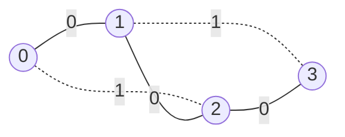

# Tasks
The subroutines, as the authors divided algorithm into and further divided by me for the sakes of DRY and the code's readability, are as follows:  
- [x] lambda `boruvka()`, referred in the paper as **Boruvka Step**, which in turn contains:  
  - [x] `choosing incident edges cycle`
  - [x] `contracting cycle`
  - [x] lambda `trim_selfs_redundants()`
- [x] `extracting random sample cycle`
- [ ] lambda `erase_f_heavies()` — ***THE EXACT PLACE I SEEK FOR HELP***. Pleaase, help Dora...
- [x] lambda `rmst()`
- [x] `mst()` member function

As one can see, almost everything is done. Each checked subroutine is O(n), afak.  
Every subroutine, imho, deserves its own section with eleborate description of how and why it works. Probably in the form of a wiki, or just here in place.  

# Test cases
Every test case are made of two files: one with `.csv` extension, one with `.mm`.  
`.csv` files [was already explained.](../README.md#limitations-so-far).  As for `.mm`, it stands for `mermaid` — diagramm creating language, including graphs.  
Don't worry! Nothing for you to learn. `Graph` already has a member function `mermaid()` dedicated to producing such files.  
Their contained code properly pasted in `.md` files will render a pretty graph! One of very few mean to visualize graphs.

## Example
Given graph: {{0;1;0}, {0;2;1}, {1;2;0}, {1;3;1}, {2;3;0}}. Its appearance:  

Very pretty, isn't it?? SHUT UP ITS PRETTY. And it fulfills the task: you can see all edges, nodes, their weights, and distinguish easily edges included and not included into MST by the algo.  
## 
